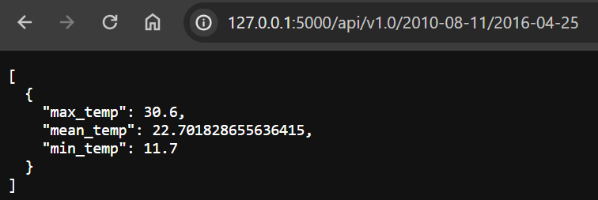

# sqlalchemy-challenge

## Summary

### Part 1: Analyse and Explore the Climate Data

Refer to `SurfsUp/climate_starter.ipynb`

* Get the most recent date in the dataset
  * 2017-08-23
* Get previous 12 months of precipitation data
  
* Plot date and precipitation for the past 12 months
  
* Use Pandas to print the summary statistics for the precipitation data  
  
* Find total number of stations in the dataset
  * 9
* Find the most active station and get the min, max and average tempartures recorded
  * USC00519281
  * Min: 12.2, Max: 29.4, Mean: 22.03582251082252
* Plot the frequency of temperatures recorded for the past 12 months
  

### Part 2: Creating Climate App

Refer to `SurfsUp/app.py`
(Default site: <http://127.0.0.1:5000/>)

* List all available routes on the homepage  
  
* Return JSON representation of dictionary of date and precipitation  
  
* For the most active station, Get JSON list of temperature observations for the previous year  
  
* Return a JSON list of the minimum temperature, the average temperature, and the maximum temperature for a specified start or start-end range
  
  

## Environment

* python3.7
* numpy1.21.5

## References

* Menne, M.J., I. Durre, R.S. Vose, B.E. Gleason, and T.G. Houston, 2012: An overview of the Global Historical Climatology Network-Daily Database. Journal of Atmospheric and Oceanic Technology, 29, 897-910, <https://doi.org/10.1175/JTECH-D-11-00103.1>, measurements converted to metric in Pandas.
* [Use relativedelta to add and subtract time](https://www.geeksforgeeks.org/how-to-add-and-subtract-days-using-datetime-in-python/)
* [Force x axis date values in plot to be datetime datatype](https://stackoverflow.com/questions/26358200/xticks-by-pandas-plot-rename-with-the-string)
* [Use functions in SQLalchemy to get min, max, avg values](https://stackoverflow.com/questions/7133007/sqlalchemy-get-max-min-avg-values-from-a-table)
